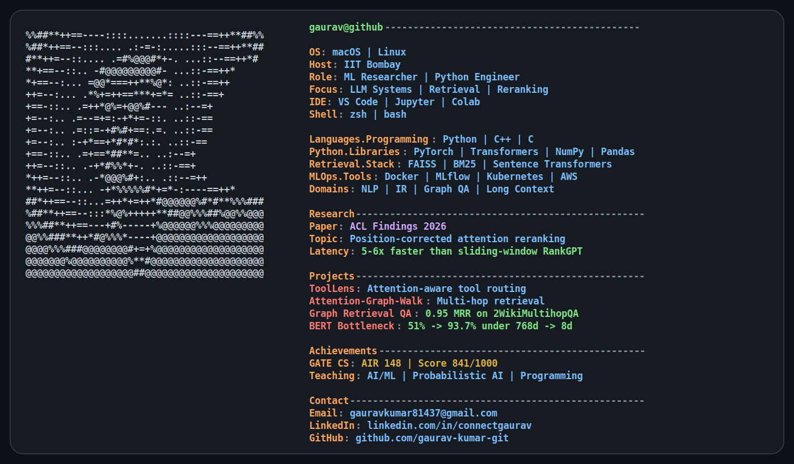

<picture>
  <source media="(prefers-color-scheme: dark)" srcset="./assets/profile-terminal-dark.svg">
  <source media="(prefers-color-scheme: light)" srcset="./assets/profile-terminal-light.svg">
  
</picture>

## Featured Python Projects

### [ToolLens](https://github.com/gaurav-kumar-git/ToolLens)
A single-forward-pass, attention-aware reranker for low-latency long-context tool selection.

### [Attention-Graph-Walk](https://github.com/gaurav-kumar-git/Attention-Graph-Walk)
Attention-guided retrieval for multi-hop reasoning over long contexts.

### [Graph-Enhanced Retrieval QA](https://github.com/gaurav-kumar-git/graph-enhanced-retrieval-qa)
A graph neural retrieval pipeline that achieved **0.95 MRR** on 2WikiMultihopQA.

### [BERT Information Bottleneck](https://github.com/gaurav-kumar-git/bert-information-bottleneck)
An experimental pipeline studying discriminative and reconstructive learning under compressed representations.

## Python Toolkit

  

## GitHub Activity

  
  

